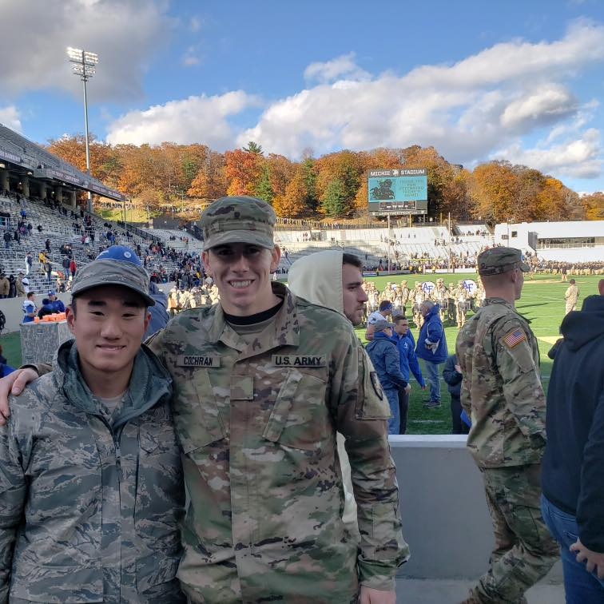

# PEX-4-CHWA-WANG
C Spell Checker

## Functionality
This C program takes a dictionary file and a test file as arguments. Upon running, it will store the dictionary file in 
a ternary search tree to optimize a search function's time complexity. Additionally, it will check all words within
the test file against the dictionary and produce a list of correctly and incorrectly spelled words.

Example output:
```shell script
Spellchecking:
HOTCHPOT: Correct
PUNDITRIES: Correct
FANYON: Incorrect
QUBYTE: Correct
```
All relevant files are in the `./src` directory.

### How to Run
You can choose to run this code in a terminal or through the CLion IDE. Details are below:

#### Terminal
You can run the .exe through a terminal via:
```shell script
PEX_4_CHWA_WANG.exe arg1 arg2
```
where `arg1` is the relative file path to a dictionary file (e.g. `../files/dictionary.txt`) and `arg2` is 
the relative file path to a test file (e.g. `../files/test1.txt`).

#### CLion IDE
If you choose to run via CLion, **you will need to reload the CMake Project before running**. Otherwise, caching issues
 will prevent the build from finishing.
 
It is configured to run
```shell script
PEX_4_CHWA_WANG.exe ../files/dictionary.txt ../files/test1.txt
```
by default.

## About Team CHWANG
We're just two guys who *really* love ternary trees.

### C2C Christopher Chwa 

* absolute beast at file I/O and tree functions
* dope middle name
* often is confused for C2C Wang (see below)

### C2C Jim Wang 

* gets lost on his way to the IDE
* "what is gi-thub?"
* often is confused for C2C Chwa (see above)